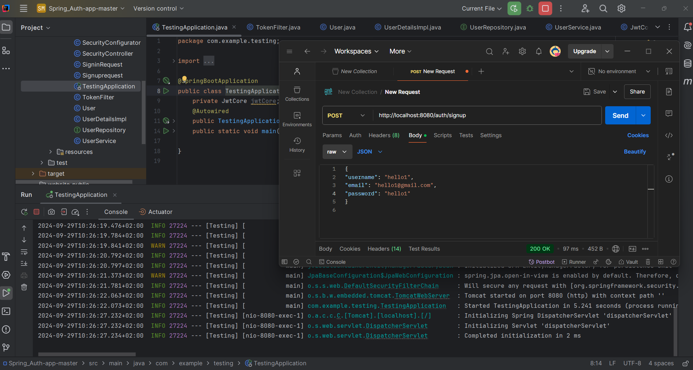

<h1 align="center">
  <br>
  <br>
  JwtAuthentication App using Spring
  <br>
</h1>

<h4 align="center">Application created as a mine pet project</h4>


## Key Technologies

* JWT Tokens authentication and authorization
* Maven
* Spring  
* Launched with Postgres
* Tested with Postman and React app
* REady to be hosted (already contenirized with Docker)


## How To Use

To clone and run this application, you'll need [Git](https://git-scm.com) and [Node.js](https://nodejs.org/en/download/) (which comes with [npm](http://npmjs.com)) installed on your computer. From your command line:

```bash
# Clone this repository
$ git clone repository url

# Go into the repository
$ cd Spring-auth-JWTToken-app

# Install dependencies

# Run the app starting from entry point
```

> SCREENS
## SignUp

SignIn

Database state

Getting secured user

<h2 align="center">Connecting with React</h2>


